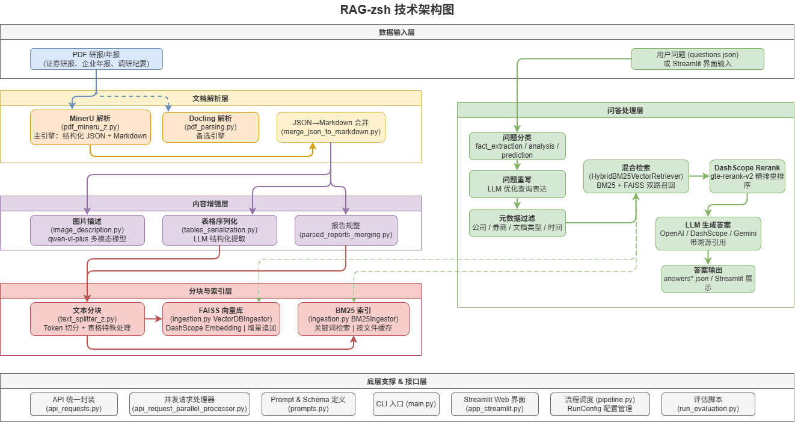
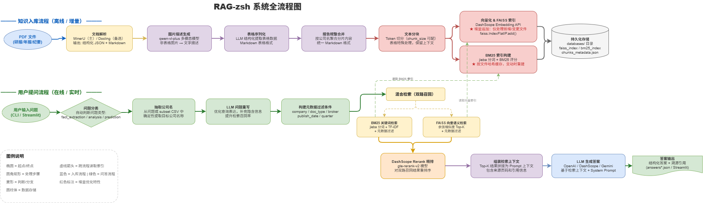

# RAG-zsh 企业知识库问答系统

基于大语言模型的 RAG（检索增强生成）智能问答系统，专注于证券研报与企业年报的文档解析、混合检索与精准问答。

## 核心功能

- **PDF 文档解析**：集成 MinerU（主）与 Docling 两种解析引擎，支持表格、图表、图片的结构化提取
- **多路混合检索**：BM25 关键词检索 + FAISS 向量语义检索 + DashScope Rerank 精排
- **LLM 智能问答**：支持 OpenAI / DashScope（通义千问）/ Gemini 等多种大模型
- **Streamlit 可视化界面**：提供交互式 Web 问答界面
- **灵活配置系统**：通过 RunConfig 可自由组合不同检索策略和模型

## 技术架构

### 系统组件关系图

展示各模块之间的依赖与数据流向：



### 系统全流程图

包含**知识入库流程**（离线/增量）和**用户提问流程**（在线/实时）两条主线：




## 快速开始

### 环境准备

```bash
# 克隆项目
git clone <your-repo-url>
cd RAG-zsh

# 创建虚拟环境
python -m venv venv
venv\Scripts\Activate.ps1   # Windows (PowerShell)

# 安装依赖
pip install -r requirements.txt
```

### 配置 API Key

复制 `.env.example` 为 `.env`，并填入你的 API 密钥：

```bash
cp .env.example .env
# 然后编辑 .env 文件，填入真实的 API Key
```

### 运行方式

#### 方式一：CLI 命令行

```bash
# 查看所有可用命令
python main.py --help

# 下载 Docling 模型
python main.py download-models

# 解析 PDF 报告（支持并行）
python main.py parse-pdfs --parallel --chunk-size 2 --max-workers 10

# 序列化表格
python main.py serialize-tables

# 处理报告（分块+向量化）
python main.py process-reports --config no_ser_tab

# 批量回答问题
python main.py process-questions --config hybrid_bm25_vector
```

#### 方式二：直接运行 pipeline

编辑 `src/pipeline.py` 底部的 `__main__` 部分，取消注释需要执行的步骤：

```bash
python src/pipeline.py
```

#### 方式三：Streamlit Web 界面

```bash
streamlit run app_streamlit.py
```

## 项目结构

```
RAG-zsh/
├── app_streamlit.py          # Streamlit Web 交互界面
├── main.py                   # CLI 命令行入口
├── setup.py                  # 包安装配置
├── requirements.txt          # Python 依赖
│
├── scripts/                  # 运行脚本与部署脚本
│   ├── run_evaluation.py     # 运行评估
│   ├── run_questions.py      # 运行问答
│   ├── run_rebuild.py        # 重建索引
│   └── autodl_deploy.sh      # AutoDL 部署脚本
│
├── src/                      # 核心源代码
│   ├── pipeline.py           # 主流程调度与配置管理
│   ├── api_requests.py       # LLM API 统一封装（OpenAI/DashScope/Gemini）
│   ├── api_request_parallel_processor.py  # 并发请求处理器
│   ├── retrieval.py          # 四种检索器实现
│   ├── reranking.py          # DashScope Rerank 重排序
│   ├── ingestion.py          # 向量库与 BM25 索引构建
│   ├── questions_processing.py  # 问答核心逻辑
│   ├── pdf_mineru_z.py       # MinerU PDF 解析（增强版）
│   ├── pdf_parsing.py        # Docling PDF 解析
│   ├── text_splitter_z.py    # 文本分块（增强版）
│   ├── tables_serialization.py  # 表格序列化
│   ├── image_description.py  # 图片智能描述
│   ├── merge_json_to_markdown.py  # JSON 转 Markdown
│   ├── parsed_reports_merging.py  # 报告规整
│   └── prompts.py            # Prompt 与 Schema 定义
│
├── data/                     # 数据目录
│   └── stock_data/           # 证券研报数据集
│       ├── pdf_reports/      # 原始 PDF 文件
│       ├── questions.json    # 待回答的问题列表
│       ├── answers/          # 生成的答案
│       ├── databases/        # 检索索引（FAISS向量库/BM25，支持增量更新）
│       └── debug_data/       # 调试中间数据
│
├── tests/                    # 单元测试
├── docs/                     # 文档与图表
│   ├── src_modules_overview.md  # 模块详细说明
│   ├── architecture.drawio      # 技术架构图（draw.io 源文件）
│   └── flowchart.drawio         # 系统全流程图（draw.io 源文件）
└── reference/                # 参考代码
```

## 可用配置 (RunConfig)

| 配置名 | 说明 | 特点 |
|--------|------|------|
| `base` | 基础配置 | 向量检索 + GPT-4o-mini |
| `pdr` | 父文档检索 | 检索 chunk 后返回整页内容 |
| `max` | 全功能配置 | 父文档检索 + LLM 重排 |
| `hybrid_bm25_vector` | **推荐配置** | BM25 + 向量混合召回 + DashScope Rerank |

## 数据集说明

当前内置数据集为 **中芯国际证券研报与年报**，包含：
- 8 份 PDF 研报/年报（上海证券、东方证券、光大证券等）
- 覆盖营收、利润、产能、研发等多维度问题

可通过修改 `data/stock_data/questions.json` 自定义问题。

## 主要依赖

- `faiss-cpu` - 向量相似度检索
- `rank-bm25` - BM25 关键词检索
- `dashscope` - 通义千问 API + Embedding + Rerank
- `openai` - OpenAI 兼容 API
- `streamlit` - Web 界面框架
- `sentence-transformers` - 句子向量化
- `PyPDF2` - PDF 处理工具

## License

MIT
